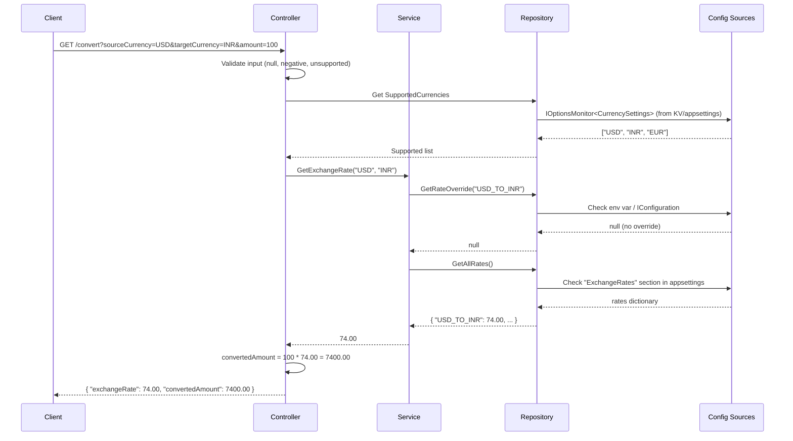

# Currency Converter API - Project Documentation

## Overview

A .NET 10 ASP.NET Core Web API that converts amounts between currencies (USD, INR, EUR) using configurable exchange rates. The API follows a **3-tier architecture**.

---

## Architecture (3-Tier)

```
┌─────────────────────────────────────────────────────────┐
│  Presentation Layer (Controllers/)                       │
│  - Handles HTTP requests/responses                       │
│  - Input validation                                      │
├─────────────────────────────────────────────────────────┤
│  Business Logic Layer (Services/)                        │
│  - Conversion logic                                      │
│  - Rate lookup strategy (override > config > file)       │
├─────────────────────────────────────────────────────────┤
│  Data Access Layer (Repositories/)                       │
│  - Reads exchange rates from file/config                 │
│  - Reads supported currencies from Azure KV / config     │
│  - Environment variable overrides                        │
└─────────────────────────────────────────────────────────┘
```

---

## Request Flow



---

## Configuration Priority (Highest → Lowest)

| Priority | Source | Dynamic Reload? |
|----------|--------|-----------------|
| 1 | Environment variables (`USD_TO_INR=81.00`) | Set before run |
| 2 | Azure Key Vault (when `KeyVaultUri` is configured) | Yes |
| 3 | `appsettings.json` → `"ExchangeRates"` section | Yes (on file save) |
| 4 | `exchangeRates.json` local file | Yes (on file save) |

**Supported currencies** follow the same chain via `CurrencySettings:SupportedCurrencies`.

---

## API Endpoints

### GET /convert

Converts an amount from source to target currency.

**Query Parameters:**

| Parameter | Type | Required | Description |
|-----------|------|----------|-------------|
| sourceCurrency | string | Yes | ISO 4217 code (USD, INR, EUR) |
| targetCurrency | string | Yes | ISO 4217 code (USD, INR, EUR) |
| amount | decimal | Yes | Amount to convert (≥ 0) |

**Success Response (200):**
```json
{
  "exchangeRate": 74.00,
  "convertedAmount": 7400.00
}
```

**Error Responses:**
- `400 Bad Request` — missing/invalid parameters, unsupported currency
- `404 Not Found` — exchange rate pair not configured

---

## Example Usage

### Convert 100 USD to INR
```
GET http://localhost:5286/convert?sourceCurrency=USD&targetCurrency=INR&amount=100
```
**Response:**
```json
{
  "exchangeRate": 74.00,
  "convertedAmount": 7400.00
}
```

### Convert 500 EUR to USD
```
GET http://localhost:5286/convert?sourceCurrency=EUR&targetCurrency=USD&amount=500
```
**Response:**
```json
{
  "exchangeRate": 1.18,
  "convertedAmount": 590.00
}
```

### Same currency (no conversion)
```
GET http://localhost:5286/convert?sourceCurrency=USD&targetCurrency=USD&amount=250
```
**Response:**
```json
{
  "exchangeRate": 1,
  "convertedAmount": 250.00
}
```

### Invalid request (missing parameter)
```
GET http://localhost:5286/convert?sourceCurrency=USD&targetCurrency=INR
```
**Response (400):**
```json
{
  "error": "amount is required."
}
```

### Unsupported currency
```
GET http://localhost:5286/convert?sourceCurrency=GBP&targetCurrency=INR&amount=100
```
**Response (400):**
```json
{
  "error": "Unsupported source currency: 'GBP'. Supported currencies: USD, INR, EUR"
}
```

---

## How to Change Exchange Rates (Without Restart)

### Option 1: Edit `appsettings.json`
```json
"ExchangeRates": {
  "USD_TO_INR": 82.50
}
```
Save the file → next request uses the new rate.

### Option 2: Edit `exchangeRates.json`
```json
{
  "USD_TO_INR": 82.50
}
```
Save the file → auto-detected on next request.

### Option 3: Environment variable (before startup)
```bash
set USD_TO_INR=82.50
dotnet run
```

---

## How to Run

```bash
cd CurrencyConverter
dotnet run
```

Swagger UI opens automatically at `http://localhost:5286/swagger`.

## How to Run Tests

```bash
cd CurrencyConverter.Tests
dotnet test
```

---

## Project Structure

```
CurrencyConverter/
├── Controllers/
│   └── CurrencyController.cs         # Presentation layer - HTTP handling
├── Services/
│   ├── IExchangeRateService.cs        # Business logic interface
│   └── ExchangeRateService.cs         # Conversion logic
├── Repositories/
│   ├── IExchangeRateRepository.cs     # Data access interface
│   └── ExchangeRateRepository.cs      # File/config reading
├── Models/
│   ├── ConversionResponse.cs          # Success DTO
│   ├── ErrorResponse.cs               # Error DTO
│   └── CurrencySettings.cs            # Config model (supported currencies)
├── exchangeRates.json                 # Local exchange rate data
├── appsettings.json                   # App configuration + rate overrides
└── Program.cs                         # DI, middleware, startup

CurrencyConverter.Tests/
├── ExchangeRateServiceTests.cs        # Service unit tests
└── CurrencyControllerTests.cs         # Controller unit tests
```

---

## Key Design Decisions

1. **3-Tier Architecture** — Clean separation: Controllers → Services → Repositories
2. **Dynamic Configuration** — Exchange rates reload on file change (no restart needed)
3. **Azure Key Vault** — Supported currencies configurable via KV with local fallback
4. **IOptionsMonitor** — Enables runtime config reload without app restart
5. **Scoped DI Lifetime** — Fresh instances per HTTP request for up-to-date config
6. **Environment Variable Override** — Highest priority for rate overrides
